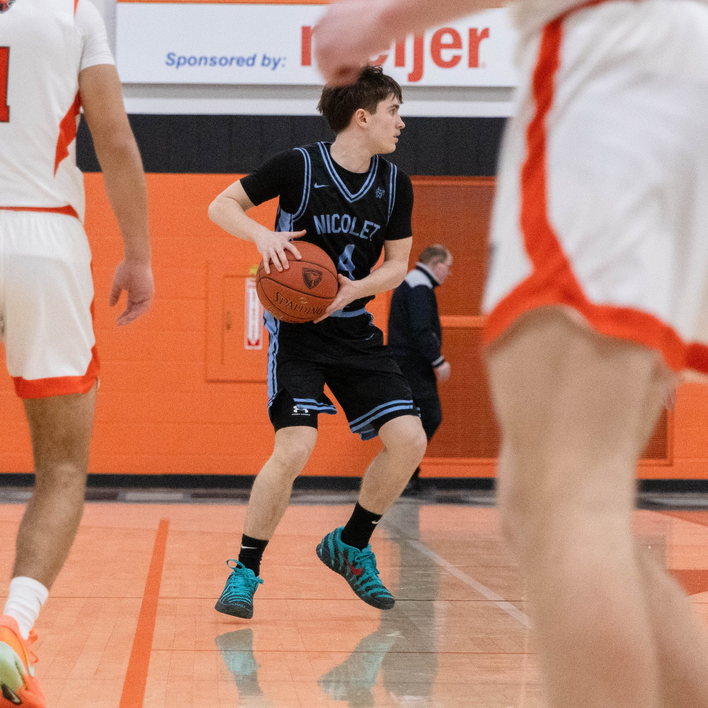
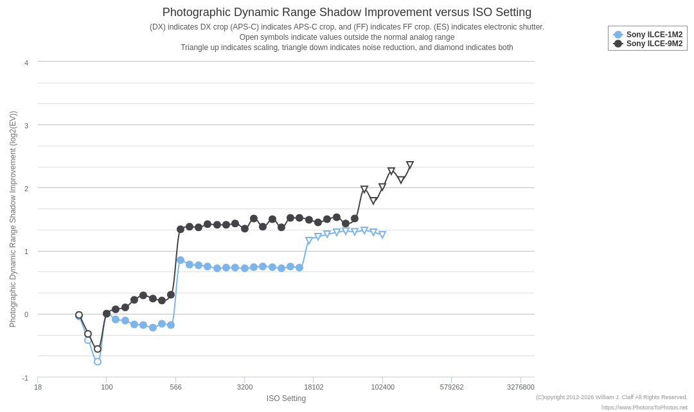

I recently saw a [video from minutephysics](https://youtu.be/ZWSvHBG7X0w) which I am blatently stealing and repackaging in the form of a blog post. This video was interesting to me in a number of ways. First, PHYSICS! Second, I'm a photographer, and I regularly shoot low ISO values, around 100-300, when shooting outdoor sports. This came from the idea that higher ISO creates more noise in the image, which turns out to be *kind of* true, but not the full truth.

Notice the grain in this image, which has been RGB reduced slightly, but the B&W grain is still visible. This photo was shot with ISO 4000 on a crop-sensor camera, wide open aperture, and a 1/1000 of a second shutter speed. The ISO, in this case, was high so I could speed up the shutter. The gym I was shooting in was pretty well lit, but I still had to use almost ten times the ISO value for this shot.

This was, again, wide open aperture, but 1/2000 shutter, but because it was much brighter outside at 7:00 PM when this photo was taken, I could lower my ISO to 400 instead of 4000. There's still grain though. This is because of some physics that I won't be able to explain fully (watch the video at the start of this article), but all you really need to know is ISO is more like **amplification** of light instead of aperture or shutter speed, which controls how much light enters the camera. If you think back to film photography, ISO was the sensitivity of the film to light. Digital cameras allow ISO to be changed on the fly, but it's still adjusting sensitivity, not volume of light.

This brings me to the graph.

This shows the improvement of dynamic range (y) as ISO (x) increases for two Sony cameras. At around ISO 640-ish, there's a significant jump in dynamic range, or the range of light captured from the shadows to the highlights. This means that you're getting significantly more dynamic range at 640 ISO compared to 500, which makes it significantly easier to edit in post because you have significantly more light to work with. This doesn't mean you should always shoot 640 instead of 500, but it's a good idea to sometimes use 640 over 500. But no matter what, **set your ISO last**, as it should be a result of your shutter and aperture, not what determines it.
